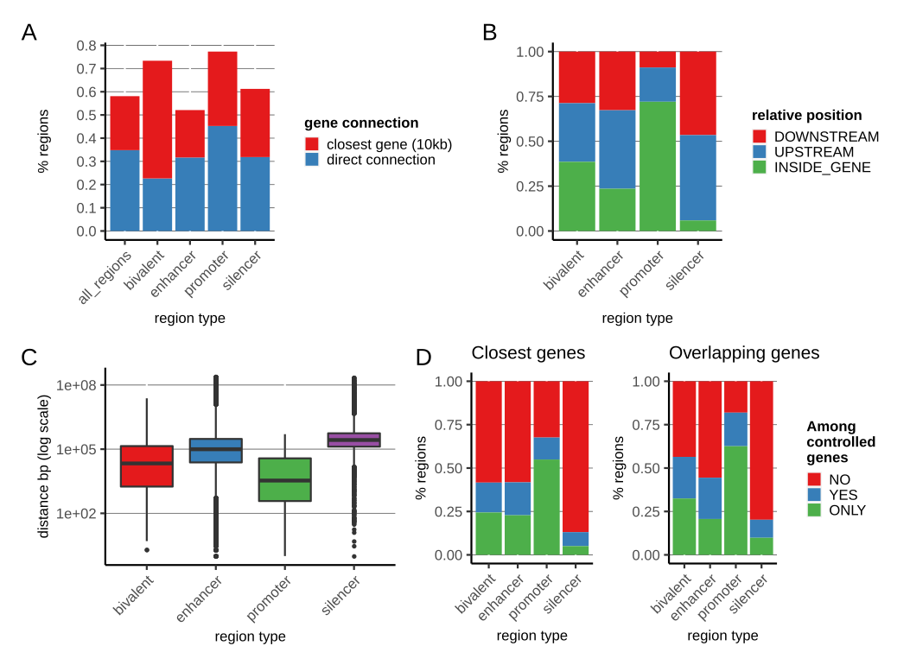
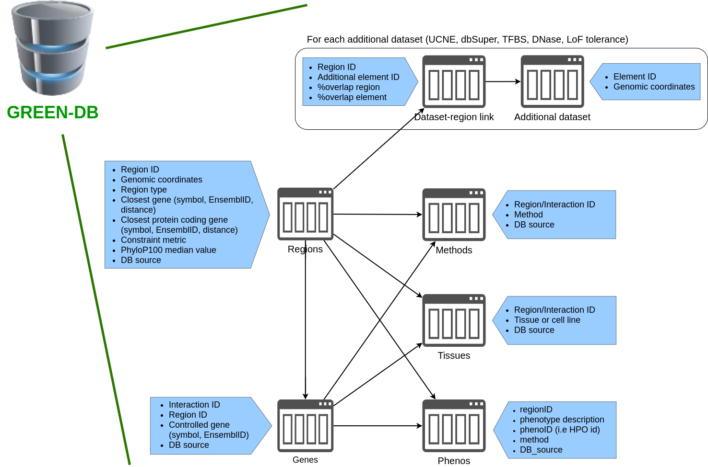
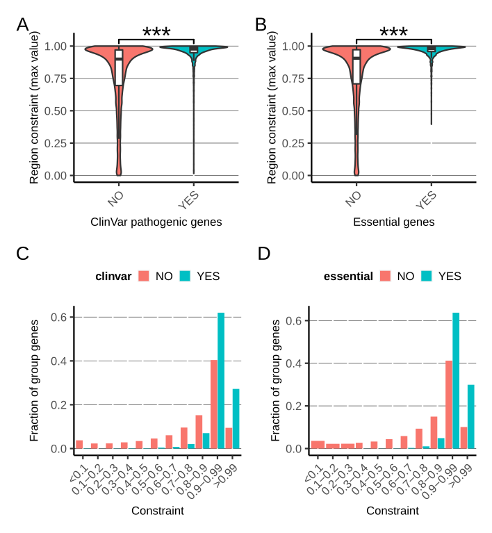
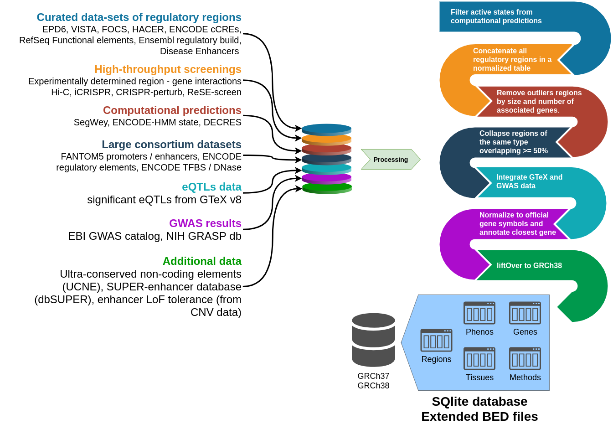

The GREEN-DB
============

GREEN-DB is a comprehensive collection of potential regulatory regions in the human genome
including ~2.4M regions from 16 data sources and covering ~1.5Gb evenly distributed across chromosomes.
The regulatory regions are grouped in 5 categories: 

+------------+------------+---------------+
| GREEN-DB   | Value      | Bases covered |
+============+============+===============+
| N Enhancer | 1832830    | 1449153178    |
+------------+------------+---------------+
| N Promoter | 565323     | 234315553     |
+------------+------------+---------------+
| N Silencer | 4302       | 11210309      |
+------------+------------+---------------+
| N Bivalent |  8409      |894792         |
+------------+------------+---------------+
| N Insulator| 23         | 17504         |
+------------+------------+---------------+
|All regions | 2410887    | 1502180018    |
+------------+------------+---------------+

Each region is described by its genomic location, region type, method(s) of detection, data source and closest gene; 
~35% of regions are annotated with controlled genes, ~40% with tissue(s) of activity, and ~14% have associated phenotype(s).
GREEN-DB is available as an SQLite database and regions information with controlled genes are also provided as 
extended bed files for easy integration into existing analysis pipelines. 

Information in the database
~~~~~~~~~~~~~~~~~~~~~~~~~~~

For details on how the database was compiled please refer to the original publication
##OURPAPER##

.. figure:: images/Figure_1_color.png
    :width: 800
    :align: center
    :alt: Summary of the database

    **Main information in the database**

    **Summary information on gene-region connections**

SQLite database structure
~~~~~~~~~~~~~~~~~~~~~~~~~

The SQLite database contains 16 tables:

- GRCh37 / GRCh38 regions 
    GREEN-DB regions coordinate; region type; constraint percentile; closest gene symbol, Ensembl ID and distance; PhyloP100 statistics
- Tissues
    tissue(s) of activity for a region or a region-gene interaction
- Genes
    controlled gene(s)
- Methods
    method(s) supporting each region and region-gene interaction. This may correspond to the data source when no specific method information was available.
- Phenotypes
    potentially associated phenotypes
- GRCh37 / GRCh38 TFBS
    transcription factor binding sites
- GRCh37 / GRCh38 DNase
    DNase hypersensitivity peaks
- GRCh37 / GRCh38 dbSuper
    super-enhancers as defined by dbSuper
- GRCh37 / GRCh38 LoF_tolerance
    the probability of LoF tolerance for enhancers
- GRCh37 / GRCh38 UCNE
    ultraconserved noncoding elements

Main tables (regions, tissues, genes and methods) are linked by the unique region ID.
Additionally, a unique interaction ID identifies each gene-region pair in the gene table and it’s linked to methods and tissues tables.
Linking tables are included that map the overlap between GREEN-DB region IDs and each of TFBS, DNase, dbSuper and LoF_tolerance region IDs, reporting also the fraction of overlap.

    **A schematic representation of GREEN-DB.**

The constraint metric
~~~~~~~~~~~~~~~~~~~~~
For each region we calculated a contraint metric representing the tolerance to genetic variations.
Constraint ranges 0-1 with higher values associated to higher level of variation constraint.
Regions with high constraint values (especially > 0.9) are more likely to control essential genes and genes involved in human diseases.

    **Constraint values for regions associated to essential/pathogenic genes**

Summary of the building process
~~~~~~~~~~~~~~~~~~~~~~~~~~~~~~~
In GREEN-DB we collected and aggregated information from 16 different sources, including

- 7 previously published curated databases
- 6 experimental datasets from recently published articles
- predicted regulatory regions from 3 different algorithms

Four additional datasets were included to integrate region to gene / phenotype relationships. 
We also collected additional data useful in evaluating the regulatory role of genomic regions, including 
- TFBS and DNase peaks
- ultraconserved non-coding elements (UCNE)
- super-enhancer definitions
- enhancer LoF tolerance

    **Summary of the GREEN-DB building process**

